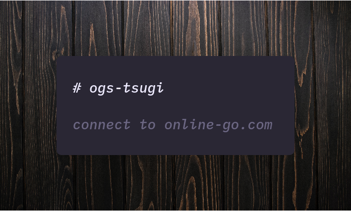

<p align="center">
    
</p>

# usage
``` haskell
>>> runOgs $ (getGame ogsClient $ GameId 16945653)
Right
  ( Game
      { id = 16945653,
        name = "VincentL vs. djanatyn",
        handicap = 0,
        black = 437141,
        white = 435842,
        rules = "chinese",
        gamedata =
          GameRecord
            { white_player_id = 435842,
              black_player_id = 437141,
              game_id = 16945653,
              komi = 5.5,
              rules = "chinese",
              winner = 435842,
              outcome = "Resignation",
              end_time = 1552319896
            }
      }
  )
  
>>> runOgs $ (getPlayer ogsClient $ PlayerId 435842)
Right
  ( Player
      { username = "djanatyn",
        name = "Jonathan Strickland",
        id = 435842
      }
  )
```
